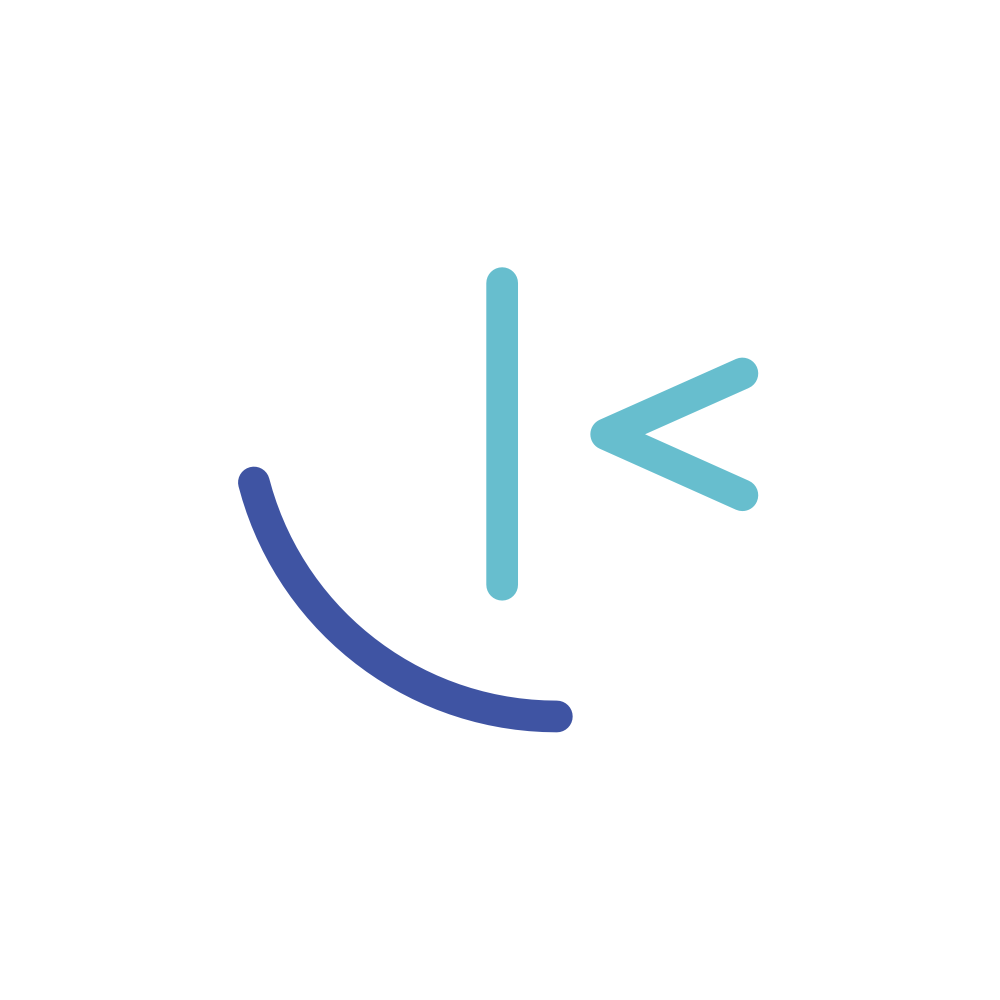

<h1 align="center">Hello World.</h1>

I'm a self-taught developer, mainly focusing on full-stack web development. I
have worked on a number of ML projects in the past, but due to time and energy constraints,
I am narrowing my efforts to a single domain.

### Technologies I use on a daily basis

### What I'm currently learning

### Connect with me

    
    

